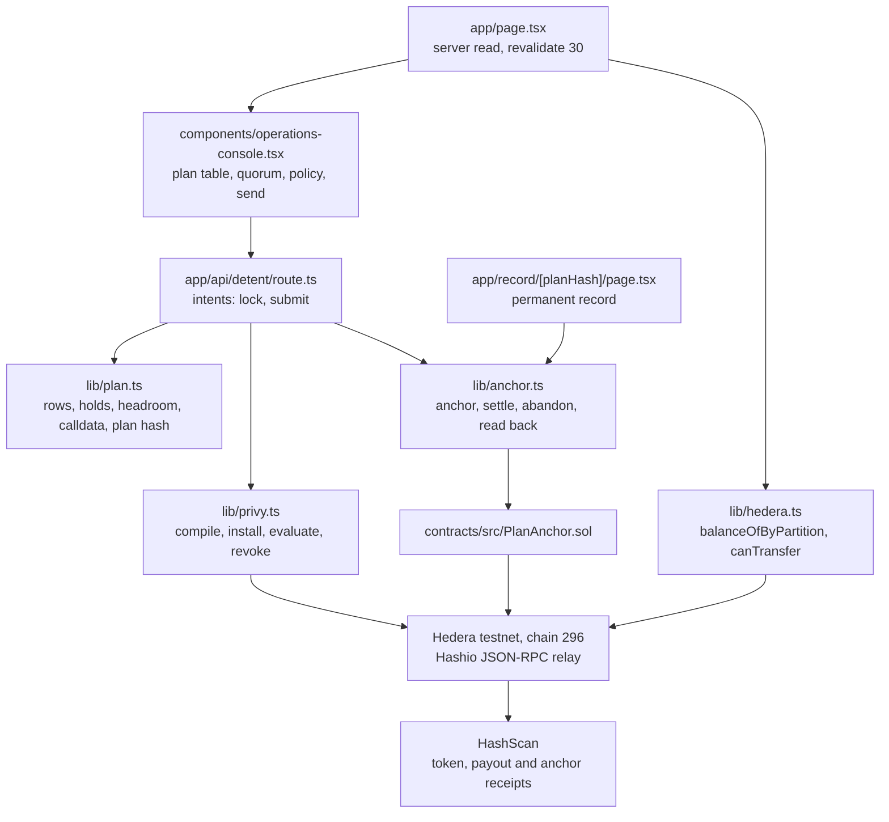

# Detent

Operator console for tokenized securities: preview a coupon run or a forced
transfer line by line, then lock the treasury wallet to exactly that transaction.

A general purpose treasury key can sign anything the token contract exposes, and
reading an explorer before you press send does not narrow it by one byte. Detent
turns the preview itself into the signing limit: the plan the operator accepts is
compiled into a wallet policy that permits that single transaction and nothing
else, and the policy dies with it.

**Open https://detent-app.vercel.app and press "Distribute quarterly coupon",
which is DEMO step 2.** Everything after that happens on the same page.

## Deployed artefacts

| Artefact | Value |
| --- | --- |
| Live app | https://detent-app.vercel.app |
| Demo video | `<ADD_VIDEO_URL>` |
| `PlanAnchor`, Hedera testnet 296 | `<ADD_PLAN_ANCHOR_ADDRESS>` |
| Smoke transaction, `anchor` | `<ADD_SMOKE_ANCHOR_TX>` |
| Smoke transaction, `settle` | `<ADD_SMOKE_SETTLE_TX>` |

The angle bracket cells are filled from the deploy output and the recording at
submission time. `DELIVERY.md` is the checklist that walks a human through it,
and `docs/VIDEO.md` is the shot list the recording follows.

## Try it in 60 seconds

No keys, no wallet connector, no sign-up. With an empty `.env.local` every step
below works against the cached register and the locally compiled policy.

1. Open `/`. The register loads: twelve holders on partition CLASS-A, three of
   them held by the compliance module.
2. Press **Distribute quarterly coupon**. The plan fills, the three held rows go
   oxide red with the reason, and the headroom prints under the totals.
3. Press **Approve** on both officers. That is the key quorum of two.
4. Press **Lock this plan to the treasury key**. The compiled policy appears with
   its four pinned conditions over `default_action: DENY`.
5. Edit one digit of the amount in the send section.
6. Press **Send edited plan**. The key refuses and names the condition that
   failed and the byte offset where the payload diverged.
7. Press **Execute the approved plan**. The untouched plan signs under the same
   wallet and the same policy, and the policy is revoked.

## The problem

Whoever operates a tokenized security, a fund administrator or the issuer's ops
lead, spends the quarter on actions that cannot be undone: coupon
distributions, court ordered transfers, freezing a screened address,
redemptions. They run against a live holder set. Today the step before signing
is reading an explorer or trusting a script, and the key that signs is a general
purpose treasury key with rights over everything the contract exposes. There is
nothing between "I think this is right" and "I just signed something the whole
cap table will feel". A wrong parameter, a lapsed allowlist entry or a thin
treasury only shows up after the transaction reverts or, worse, succeeds.

## The solution

Detent reads the holder set and the compliance state of an Asset Tokenization
Studio token from Hedera testnet, replays the selected corporate action off
chain and prints a plan: who receives what, which address the transfer hook will
reject, how much cover the treasury actually has. When the operator accepts the
plan, its calldata is compiled into a Privy wallet policy. The treasury server
wallet is then permitted to sign that contract, that selector and those exact
parameter bytes; everything else stays on `default_action: DENY`. A key quorum
with threshold two installs the policy, the transaction goes out, and the policy
is revoked. The plan hash and the HashScan link land in the audit record.

The line that matters: the preview is not a report next to the signature, the
preview *is* the signing limit.

### How it differs from what already exists

Tenderly, and the Safe integration built on it, simulate before you sign, but
the simulation and the signature are separate events, so what you previewed and
what you signed can differ. The Fireblocks policy engine is authored up front by
an administrator and its rules persist across every transaction. OpenZeppelin
Defender routes proposals through a multisig or a relayer and carries no
ERC-1400 semantics for who is eligible to be credited. Detent generates a policy
for exactly one corporate action, derived from the plan the operator read, and
throws it away afterwards.

## Architecture

Every box is a file in this repo or a network it talks to. Nothing below is
aspirational: each module named here is imported by the one above it.



## How it uses the sponsor tech

**Hedera, Asset Tokenization Studio (target track: Tokenization of Anything).**
The security is an ATS equity token on Hedera testnet. `lib/hedera.ts` reads
`balanceOfByPartition` (ERC-1410) for every holder and `canTransfer`
(ERC-1594) for the compliance verdict on a would-be credit, over the Hashio
JSON-RPC relay. The reason code the compliance module returns is what turns a
row red in the console. `contracts/src/PlanAnchor.sol` anchors each approved
plan hash on Hedera before the policy opens and settles it after, so HashScan
carries the record. Issuance, configuration and one lifecycle operation (the
coupon distribution) all happen on testnet.

**Privy, server wallets, policies and key quorums (Best B2B financial product).**
`lib/privy.ts` is the compiler and the client. `compilePolicy` turns an approved
plan into a policy with a single ALLOW rule pinning `chain_id`, `to`,
`data starts_with <selector>` and `data eq <calldata>`, on top of
`default_action: DENY`. `installPolicy` POSTs it to `/v1/policies` owned by a key
quorum of threshold two; `submitTransaction` calls
`/v1/wallets/{id}/rpc` with `eth_sendTransaction`; `revokePolicy` removes the
rule once the transaction is in. `evaluatePolicy` mirrors the same rule
evaluation locally so the refusal can be explained in words on screen, and so
the demo runs with no keys configured.

## Bounty ledger

Two bounties are claimed, both opt-in on the ETHOnline 2026 submission form. The
submission mechanics for each one live in `DELIVERY.md`.

| Bounty | Prize | Slots | Required tech | Code file | DEMO step |
| --- | --- | --- | --- | --- | --- |
| `🪙 Tokenization of Anything` | `$6,000, Up to 3 teams: $2,000 each` | 3 | Asset Tokenization Studio, Hedera testnet, HashScan | `lib/hedera.ts`, `lib/anchor.ts`, `contracts/src/PlanAnchor.sol` | 1, 5, 6 |
| `🏢 Best B2B financial product` | `$2,500` | 1 | Privy SDK, Privy wallet | `lib/privy.ts` | 3, 4, 5 |

### 🪙 Tokenization of Anything, answered

The qualification wording, verbatim: "Asset Tokenization Studio kullanmak (SDK,
kontratlar, web uygulaması veya bunların birleşimi), Hedera testnet üzerinde
deploy edip göstermek, kontratları HashScan'de doğrulamak ve beş dakikayı
geçmeyen videoda "issuance, configuration, and at least one lifecycle operation"
göstermek."

Where each clause is answered:

- **Asset Tokenization Studio.** `lib/hedera.ts` carries the ATS contract surface
  in one `parseAbi` block: `balanceOfByPartition(bytes32,address)` from ERC-1410
  and `canTransfer(address,uint256,bytes)` from ERC-1594. Both are called, not
  just declared: `liveRegisterAdapter.load()` issues one `readContract` per
  holder for `balanceOfByPartition` and a second for `canTransfer`, and the
  `bytes32` reason code the compliance module returns is what turns a row oxide
  red in the console.
- **Hedera testnet.** The `hederaTestnet` chain definition in the same file pins
  chain 296 and the Hashio relay from `HEDERA_RPC_URL`. `hederaPublicClient()` is
  the only read client in the repo, and `lib/anchor.ts` writes through the same
  chain definition with `type: "legacy"`, because the relay rejects typed
  transactions.
- **HashScan.** `lib/hashscan.ts` builds every explorer link from one constant:
  `hashscanToken` for the token and the anchor contract, `hashscanTransaction`
  for the payout and the anchor transactions, `hashscanAccount` for the treasury.
  No explorer URL is written by hand anywhere else.
- **On chain record.** `lib/anchor.ts` plus `contracts/src/PlanAnchor.sol` anchor
  the approved plan hash before the policy opens and settle it after the payout
  lands. `readPlanRecord` reads `planOf` back with no operator key, which is what
  `/record/[planHash]` renders as a permanent record.
- **The lifecycle operation** on screen is the coupon distribution: the Q3
  quarterly coupon paid to the holder set on partition CLASS-A, replayed off
  chain as a plan and then executed against the token.

### 🏢 Best B2B financial product, answered

The qualification wording, verbatim: "Privy'yi ürünün çekirdeğine koymak, en az
bir Privy cüzdanı oluşturmak veya kullanmak, bir işletme senaryosu göstermek ve
"at least one Privy control, such as policies, signers, key quorums, or intents"
uygulamak."

Every clause lands in `lib/privy.ts`:

- `compilePolicy` turns the approved plan into a policy with one ALLOW rule
  pinning `chain_id eq`, `to eq`, `data starts_with <selector>` and
  `data eq <calldata>`, over `default_action: DENY`.
- `installPolicy` POSTs that policy to `/v1/policies`, and the request body
  carries `owner: { key_quorum_id: PRIVY_KEY_QUORUM_ID }`, so the policy is owned
  by a key quorum rather than by one signer.
- `submitTransaction` calls `/v1/wallets/{id}/rpc` for `eth_sendTransaction`, and
  falls back to `eth_signTransaction` plus a Hashio broadcast when Privy will not
  send to `eip155:296`. The policy governs the signing request either way.
- `revokePolicy` DELETEs the rule once the transaction is in, so the treasury key
  gets its general authority back.
- `evaluatePolicy` mirrors the same rule evaluation locally and runs first, which
  is why the refusal can name the failed condition and the byte offset where the
  submitted calldata diverged.

The business scenario is the quarterly coupon run on a tokenized security: a
treasury operation with a two person approval step, which is the B2B flow the
prize asks for.

Stated plainly so nobody hunts for a missing package: the Privy surface used here
is the REST server wallet API with policies and a key quorum of threshold two,
not the React SDK. `@privy-io/react-auth` is deliberately not installed, because
the operator never connects a browser wallet; the treasury wallet is a server
wallet and the policy is the product.

### Depth test

Delete one file and a named demo step dies:

- Delete `lib/hedera.ts` and step 1 has no register, because
  `getRegisterSnapshot()` lives there and it is the only reader of the ATS
  contract, and step 6 has no chain client, because `hederaPublicClient()` and
  `hederaTestnet` are what `lib/anchor.ts` reads `planOf` through.
- Delete `lib/privy.ts` and step 3 has no policy to compile or install, step 4
  has no refusal, because `evaluatePolicy` is what produces the failed condition
  and the byte offset, and step 5 has no signature, because `submitTransaction`
  is the only path to a transaction hash.
- Delete `lib/anchor.ts` and step 5 loses the on chain half of the audit record,
  so the plan hash has no anchoring transaction beside it, and step 6 has nothing
  to read, because `readPlanRecord` is the route's only data source.

No two bounties occupy the same architectural seat: one chain (Hedera testnet
296), one wallet and policy provider (Privy), one store (`lib/store.ts` for the
warm-instance half plus `PlanAnchor` for the durable half), and no model
provider. The third bounty slot the event allows is left empty on purpose, see
`DELIVERY.md`.

## Tech stack

Next.js 15 (App Router), TypeScript strict, Tailwind CSS v4, shadcn primitives,
viem, Hedera testnet (chain 296) over Hashio, Asset Tokenization Studio
contracts (ERC-1400 / 1410 / 1594 / 1643 / 1644), Privy REST server wallets with
policies and key quorums, Foundry for `PlanAnchor`, Sourcify for verification,
HashScan for receipts, Vercel for hosting.

## Quickstart

```bash
npm install
cp .env.example .env.local   # every value is optional, see below
npm run dev                  # http://localhost:3000
```

With an empty `.env.local` the console runs on the cached register in
`lib/data.ts` and evaluates the compiled policy locally. That is enough to click
through the entire flow, including the refusal. Fill in
`NEXT_PUBLIC_ATS_TOKEN_ADDRESS` to read the live ATS token, and `PRIVY_APP_ID`
plus `PRIVY_APP_SECRET` to install the policy on a real treasury wallet. The
recorded demo runs with both sets filled in.

Two more keys turn on the rest of the path:

| Key | What it turns on |
| --- | --- |
| `NEXT_PUBLIC_SETTLEMENT_TOKEN_ADDRESS` | The testnet settlement token whose `balanceOf` funds the coupon draw. With it set, the treasury cover and the headroom under the plan totals are read on chain instead of taken from the seed figure. |
| `OPERATOR_PRIVATE_KEY` | The ECDSA key that deployed `PlanAnchor`. The contract pins its operator to the deployer, so anchoring from the app needs that same key. No `NEXT_PUBLIC_` prefix: it never reaches the browser. |

Contract build and deploy commands are in `contracts/README.md`.

## The anchor lifecycle

`PlanAnchor` carries the on chain half of the audit record, and the console
drives it:

1. **Lock.** The approved plan hash is anchored with the target token and the
   selector, before the wallet policy opens. The audit entry links the anchoring
   transaction on HashScan next to the plan hash.
2. **Send, allowed.** The plan is closed as settled, carrying a reference to the
   payout transaction. The audit entry then carries two HashScan links: the
   payout and the anchor.
3. **Send, refused.** The plan is closed as abandoned with the reason, so a
   refused run leaves a complete record rather than an open one.

Every call reads `planOf` before it writes. An already anchored hash returns the
existing record and sends nothing, which is what makes a rehearsal repeatable. A
missing key, a missing address or a busy relay comes back as a receipt with
`anchored: false` and a note; the anchor never fails a send.

## Store and migrations

There is no database in this product, and therefore no migration command. State
lives in exactly two places: `PlanAnchor` on Hedera testnet for the durable
record, and one in-process map behind `lib/store.ts` for the compiled policy
held between the lock and the send, plus the submission ledger that makes a
repeated send idempotent. Module scope survives warm invocations only, which is
why the send path recompiles the policy from the approved plan the client echoes
and says so in `policySource`.

Rejected on the way here: a KV blob (an Upstash account, a token and a
dependency for state whose durable copy is already on chain), and Postgres
(nothing in the five demo steps filters or joins anything, and the register is
12 rows read from a contract).

```bash
npm run demo:reset   # re-assert the fixture, rewrite the report, print the start state
npm run seed         # validate fixtures/register.seed.json
```

`demo:reset` does not reset the on chain anchors, because `PlanAnchor` has no
reset entrypoint and a plan hash is permanent. That is safe: the anchor calls
read before they write, so the second rehearsal of the same coupon run reuses
the record already on chain and the screen looks identical.

## On chain proof

`PlanAnchor` deployment and the two `Smoke.s.sol` transaction hashes (one
`anchor`, one `settle`) go here as live interaction proof:

- Contract: `<ADD_PLAN_ANCHOR_ADDRESS>`
- Anchor transaction: `<ADD_SMOKE_ANCHOR_TX>`
- Settle transaction: `<ADD_SMOKE_SETTLE_TX>`

`SECURITY.md` carries the rest: which contract and chain the app touches, which
wallet permissions it requests (none from a browser wallet, because no connector
is installed), and why there is no ERC-20 approval anywhere in the repo. Update
the address line there too after the deploy, because the deploy step rewrites
only `.env.local` and this file.

## Tests

```bash
npm test              # vitest: the edge schemas and the policy evaluator
cd contracts && forge test   # PlanAnchor, including two fuzz tests
```

`npm test` covers the two mechanisms the demo turns on: the zod validation at
the API edge, and the policy evaluation that produces the refusal with the
failing condition and the byte offset. Foundry is deliberately not wired into
the npm scripts, so the contract suite runs from `contracts/`.

## Demo, ninety seconds

1. The console opens on the register: token address, HashScan badge, twelve
   holders, three of them held by the compliance module.
2. Pick the coupon distribution. The plan fills line by line, the three held
   rows go red with the reason, and the treasury headroom prints under the
   totals.
3. Two approvers sign, the plan is locked, and the compiled policy appears:
   one contract, one selector, pinned calldata, default DENY.
4. Edit one amount in the plan and send it. The wallet refuses, and the reason
   names the condition that failed and the byte where the payload diverged.
5. Send the untouched plan. It signs, the HashScan link and the plan hash drop
   into the audit record, and the policy is revoked.
6. Open the permanent record at `/record/<planHash>`. The plan hash is read back
   off `PlanAnchor` on testnet: state settled, the same token and selector, the
   anchored and settled timestamps in UTC. Reload it and the chain still says so.

## What we would build next

- Scheduled transactions for the payment date, so a locked plan can execute in
  its window without the operator holding the session open.
- The remaining lifecycle actions: redemption, address freeze, partition
  rebalance, each with its own compliance replay.
- Move policy storage from the in-process map behind `lib/store.ts` to Privy's
  own policy read endpoint, which removes the cold start fallback.
- An importer for existing ATS deployments so an issuer can point Detent at a
  token it did not issue through us.

## Licence

MIT. The full text is in `LICENSE` at the repository root, and it covers the app,
the contracts and the fixtures alike.

## Pre-existing code and AI use

ETHOnline 2026 publishes no AI policy of its own, so nothing here is claimed
against one. What the event does require is the declaration of pre-existing code:
`Varsa önceden yazılmış kodun beyan edilmesi`, which reads in English as "any
previously written code must be declared".

There is none. Every file in this repository was written during the event, and
the commit history shows it from the first commit onward. No code was carried in
from an earlier project, and no part of the product existed before the event
started.

We used AI coding assistants for scaffolding and boilerplate. Architecture,
product decisions and final code review are our own.
